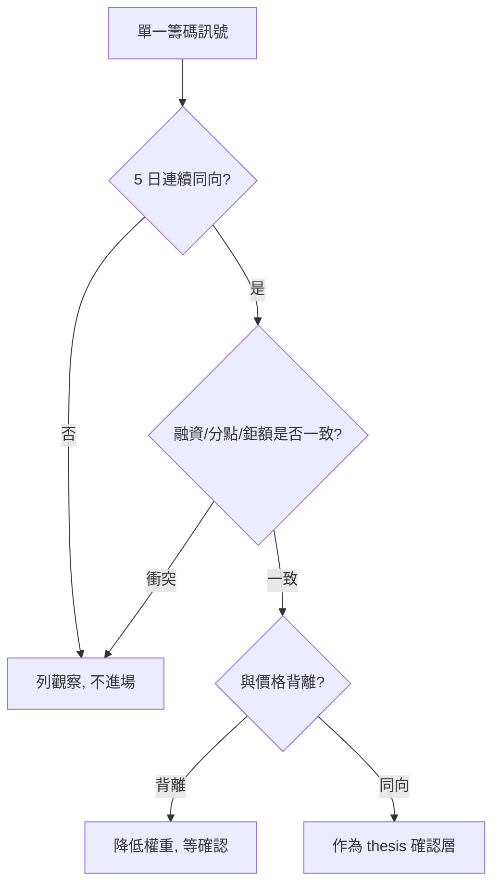

# 進階籌碼解讀

## 本篇你會學到

- 法人「自行 vs 避險」、連續性判讀
- 分點、鉅額、融資券組合訊號
- 籌碼與價格的背離處理

[← 老手專區](index.md)

基礎見 [法人術語](../02-glossary/chips.md)、[籌碼圖](../04-charts/chips-charts.md)。

---

## 法人：看連續，不看單日

| 做法 | 說明 |
|------|------|
| **5 日累計** | 比單日買超可靠 |
| **自行買賣** | 較能反映方向性 |
| **避險** | 可能對沖，勿過度解讀 |

| 價量籌碼 | 解讀 |
|----------|------|
| 價漲 + 法人連買 | 一致 |
| 價漲 + 法人連賣 | [背離](../02-glossary/market-terms.md#量價背離)，警惕 |
| 價跌 + 法人連買 | 可能是佈局期 |

表：[三大法人](../03-tables/institutional.md)

---

## 分點進階

[分點](../02-glossary/chips.md#分點) 資料 T+1，適合**中短線**：

| 觀察 | 注意 |
|------|------|
| 同一分點連續買超 | 可能有主力布局 |
| 單日大額 | 可能是對敲或調節，需多日確認 |
| 外資分點 vs 本土 | 區分資金屬性 |

勿把分點當「必漲訊號」。

---

## 鉅額交易

| 情境 | 解讀 |
|------|------|
| 低檔連續鉅額買 | 關注 |
| 高檔鉅額買 | 可能是短線過熱或換手 |
| 高檔鉅額賣 | 壓力增 |

見 [鉅額表](../03-tables/block-trade.md)、案例 [法說與籌碼](../07-cases/conference-chips.md)。

---

## 融資券組合

| 組合 | 常見情境 |
|------|----------|
| 融資增 + 價漲 | 散戶槓桿追價 |
| 融券增 + 價漲 | 可能 [軋空](../07-cases/short-squeeze.md) |
| 融資急減 + 價跌 | 斷頭或停損潮 |
| 借券增 + 價橫盤 | 空方布局，觀察後續 |

表：[融資融券](../03-tables/margin.md)

---

## 集保大戶 {#集保大戶}

**集保戶股權分散表（TDCC）** 是比每日法人買賣超更具全貌、較不受單日雜訊干擾的股權結構資料。每週公布（以週五登摺餘額為準，約週六上午後產表），適合 [中線](../08-investing/swing-mid.md)。

來源：[TDCC 股權分散表](https://www.tdcc.com.tw/portal/zh/smWeb/qryStock)；提供機關為金管會證期局。

### 怎麼讀大戶 vs 散戶

| 現象 | 解讀 |
|------|------|
| 高級距（1,000,001 股以上）持股% 上升、總股東人數下降 | 籌碼經洗盤流向核心，趨於穩定；小市值＋基本面轉機易拉抬 |
| 籌碼流向 1～999 股散戶級距 | 結構脆弱，易羊群效應，反轉時恐流動性踩踏 |

### 底層機制（容易誤判處）

| 機制 | 影響 |
|------|------|
| **ID 跨券商歸戶** | 同一身分證／統編無論開幾個帳戶，皆算**一戶**，大股東無法用人頭帳戶掩飾持股 |
| **設質專戶** | 大股東質押股票會移入該股專屬「設質專戶」，**無論多少人質押皆計一戶**；可能使高級距股東人數異常減少、比例向單一戶集中——**勿誤判為單一主力收購** |
| **融券／借券賣出** | 交割後所有權移轉至買方，反映在買方（常為較低級距散戶）庫存；大量放空時籌碼可能短暫「向散戶擴散」假象 |

!!! warning "別把財務槓桿當收購訊號"
    看到某高持股級距「人數驟減、比例飆升」，先確認是不是**設質專戶**集中效應，而非真有主力大買。

---

## 籌碼進場檢查（老手版）

| # | 條件 |
|---|------|
| 1 | 法人 5 日方向與投資論點（thesis）一致？ |
| 2 | 融資未異常過熱？ |
| 3 | 鉅額與分點無明顯高檔出貨？ |
| 4 | 與 [多週期](multi-timeframe.md) 技術不衝突？ |

## 自我檢查

??? question "1.（概念題）集保表「高級距人數驟減、比例飆升」一定要先查什麼？"
    參考答案：是否為**設質專戶**集中效應，而非單一主力收購；見 [集保大戶](#集保大戶)。

??? question "2.（判斷題）外資單日大買超就可以進場？"
    參考答案：不行。宜看 **5 日連續方向** 並與融資、鉅額、價格趨勢交叉驗證。

??? question "3.（情境題）融券大增 + 股價上漲，可能代表什麼？"
    參考答案：可能醞釀 [軋空](../07-cases/short-squeeze.md)，但仍須確認籌碼與 thesis 一致。

---

## 重點回顧

- 籌碼是**確認層**，不能取代基本面 thesis。
- 組合多訊號比單一「外資買超」可靠。
- 延伸：[事件手冊](event-playbook.md)
