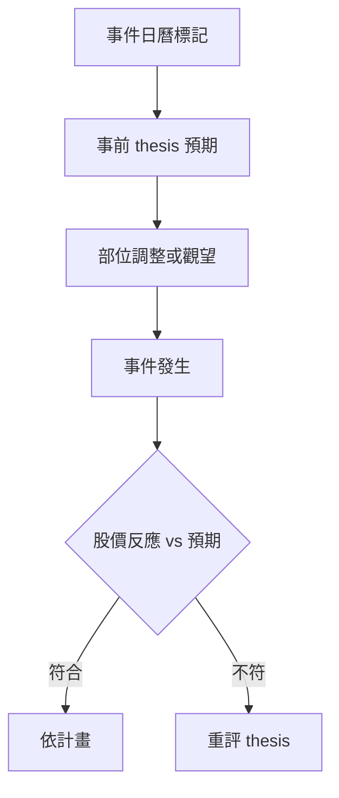

# 事件操作手冊

## 本篇你會學到

- 法說、營收、除權息、財報等事件前後怎麼規劃
- 「利多出盡」與預期管理
- 各事件的檢查清單

[← 老手專區](index.md)

---

## 事件共通原則

| 原則 | 說明 |
|------|------|
| **Priced in** | 股價常領先公告 | [好公司≠好股票](../05-analysis/fundamental-framework.md#好公司好股票) |
| **事前寫計畫** | 事件前決定進出，非當下情緒 |
| **事後看反應** | 公告後走勢比公告內容有時更重要 |

---

## 月營收公布

| 時點 | 動作 |
|------|------|
| 公布前 | 投資論點（thesis）預期 MoM/YoY；股價是否已反映 |
| 公布當日 | 對照 [營收表](../03-tables/revenue.md) |
| 公布後 | 連續 2～3 月驗證趨勢，非單月 |

案例：[營收轉折](../07-cases/revenue-turn.md)

---

## 法說會

| 時點 | 動作 |
|------|------|
| 前 | 看股價是否已漲多；讀上次法說承諾 |
| 中 | 成長驅動、風險、毛利率指引 |
| 後 | [言行邏輯](../03-tables/deep-dive-tabs.md)、法人 5 日 |

見 [法說會](../05-analysis/conference.md)、[法說與籌碼案例](../07-cases/conference-chips.md)。

---

## 季報 / 財報

| 重點 | 工具 |
|------|------|
| EPS vs 預期 | [財報表](../03-tables/financials.md) |
| 三率變化 | [基本面圖](../04-charts/fundamental-charts.md) |
| 指引下修 | thesis 失效條件 |

---

## 除權息

| 時點 | 動作 |
|------|------|
| 除息前 | 勿盲目搶息；算 [稅費](../01-basics/settlement-fees.md) |
| 除息日 | 價格下修正常 |
| 除息後 | 觀察 [填息](../02-glossary/market-terms.md#填息) |

案例：[除權息參與](../07-cases/dividend-play.md)

---

## 題材 / 新聞

| 類型 | 老手態度 |
|------|----------|
| 首次爆料 | 驗證來源、對營收影響 |
| 流傳已久 | 警惕 [利多出盡](../02-glossary/market-terms.md#利多利空出盡) |
| 政策 | 看 [行業層次](../05-analysis/fundamental-framework.md#行業層次) |

---

## 事件前後流程

日程：[除權息表](../03-tables/dividend-schedule.md)、公開資訊觀測站。

---

## 重點回顧

- 事件交易的核心是**預期差**，不是公告文字。
- 短線可參與事件；中長線看 2～3 季驗證。
- 延伸：[研究流程](research-workflow.md)
