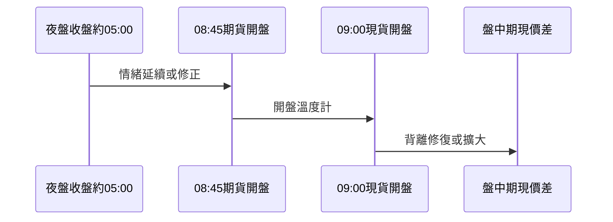

# 期貨輔助現貨判斷

## 本篇你會學到

- 台指期、夜盤、期現價差如何輔助**現股**決策
- 為何不建議散戶以期貨為主戰場
- 四個觀察時點

[← 老手專區](index.md) · 先讀 [期貨入門](../01-basics/futures-intro.md)

!!! note "定位"
    本站教**現股現貨**；期貨在此是**領先儀表板**，不是鼓勵高槓桿炒期貨。

---

## 期貨 vs 現股

| 項目 | 台指期 | 現股 / ETF |
|------|--------|------------|
| 本質 | 指數預期、零和博弈色彩 | 公司所有權 |
| 槓桿 | 保證金、斷頭風險 | 全額交割（較可控） |
| 適合 | 專業短線、避險 | 多數老手主戰場 |

### 合約規格（認識用）

| 商品 | 每點價值（教學參考） |
|------|----------------------|
| 大台（TX） | 200 元 |
| 小台（MTX） | 50 元 |
| 微台 | 10 元 |

保證金、結算詳見 [期貨入門](../01-basics/futures-intro.md)。

[期現價差](../02-glossary/chips.md#期現價差) 術語見籌碼章。

---

## 四個觀察時點

| 時點 | 觀察 | 對現股的提示 |
|------|------|--------------|
| **夜盤收盤**（約 05:00） | 反映美股後段 | 開盤情緒預判 |
| **08:45 期貨開盤** | 開盤溫度計 | 早盤賣壓強弱 |
| **09:00 現貨開盤** | 期現是否背離修復 | [跨市場](../05-analysis/cross-market.md) |
| **盤中** | [期現價差](../02-glossary/chips.md#期現價差) | 情緒過熱/保守 |

---

## 常見盤型（教學用）

| 盤型 | 現象 | 現股策略參考 |
|------|------|--------------|
| 夜盤跌 + 08:45 續跌 | 開盤壓力大 | 早盤少追，等 09:30 後（見 [盤中時間熱點](../04-charts/intraday-charts.md#盤中時間熱點早盤宜集中觀望)） |
| 夜盤跌 + 08:45 止穩 | 恐慌宣洩 | 觀察現貨開盤承接 |
| 正價差過大 | 情緒過熱 | 短線保守 |
| 逆價差 | 情緒保守 | 勿盲目殺低（除權息季節調整） |

與 [當沖](../08-investing/day-trade.md)、[隔日沖](../08-investing/overnight.md) 高度相關。

---

## 外資期貨未平倉（進階）

每日盤後公布，適合**波段**：

| 現象 | 簡化解讀 |
|------|----------|
| 淨多單增加 | 外資期指偏多（非保證現貨漲） |
| 淨空單大增 | 提防現貨賣壓 |

需與現貨法人買賣超交叉驗證。期貨基礎 → [期貨入門](../01-basics/futures-intro.md)。

## 自我檢查

??? question "1.（概念題）台指期對現股投資人的定位是什麼？"
    參考答案：**期貨為輔、現貨為主**——用期貨看開盤情緒溫度，用現股下單。

??? question "2.（判斷題）台指期大幅正價差，可以不加驗證就追價？"
    參考答案：不行。正價差過大常代表情緒過熱，短線宜保守；仍須對照個股 thesis。

??? question "3.（情境題）夜盤大跌、08:45 續跌，當沖族早盤該怎麼做（教學參考）？"
    參考答案：早盤**少追**，宜觀望至 **09:30** 後再評估；見 [盤中時間熱點](../04-charts/intraday-charts.md#盤中時間熱點早盤宜集中觀望)。

## 重點回顧

- **期貨為輔、現貨為主**：用期貨看溫度，用現股下單。
- 搭配 [多週期](multi-timeframe.md) 大盤層與 [大盤圖](../04-charts/market-charts.md)。
- 延伸：[跨市場](../05-analysis/cross-market.md)
