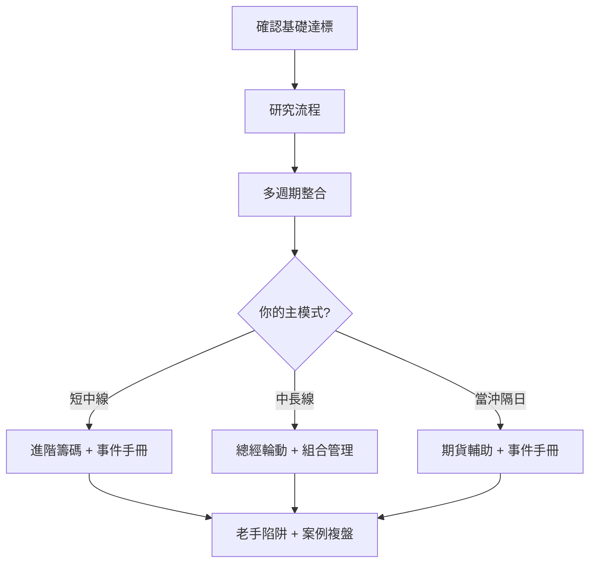

# 老手專區總覽

## 本篇你會學到

- 熟悉基礎之後，還該學什麼
- 老手學習路徑與各章定位
- 與新手章節的銜接關係

!!! warning "免責聲明"
    進階內容假設你已能獨立看表、看圖、選模式；仍不構成投資建議。

---

## 什麼算「老手」

不是交易年資，而是**能否穩定做到**：

| 檢查項 | 對應章節 |
|--------|----------|
| 看得懂報價與五檔 | [報價畫面](../01-basics/quote-screen.md) |
| 能區分 K 線、量價、籌碼、基本面圖 | [圖表總覽](../04-charts/index.md) |
| 已選定主 [投資模式](../08-investing/index.md) | 當沖～ETF 至少精熟一種 |
| 會用停損與算交易成本 | [風控](../06-risk/stop-loss.md) |
| 讀過 3 篇以上 [案例](../07-cases/revenue-turn.md) | 能寫出投資論點（thesis）與反思 |

若尚不穩，請回 [入門導覽](../01-basics/index.md)、[對號入座](../10-persona/index.md) 或 [如何選模式](../08-investing/choose-style.md)。

---

## 老手要補的缺口（新手章節不會講透的）

| 缺口 | 老手專章 |
|------|----------|
| 零散知識 → **系統流程** | [研究流程](research-workflow.md) |
| 單一週期 → **多週期整合** | [多週期整合](multi-timeframe.md) |
| 單檔好 → **組合怎麼配** | [組合管理](portfolio.md) |
| 個股微觀 → **總經與輪動** | [總經與類股輪動](macro-rotation.md) |
| 法人表 → **籌碼深度** | [進階籌碼](advanced-chips.md) |
| 公告當天怎麼辦 | [事件操作手冊](event-playbook.md) |
| 期貨是什麼、保證金怎麼算 | [期貨入門](../01-basics/futures-intro.md) |
| 期貨能不能當領先指標 | [期貨輔助現貨](futures-signal.md) |
| 有經驗仍常虧 | [老手陷阱](veteran-pitfalls.md) |
| 保單、外幣與股票怎麼放 | [投資型保單](../08-investing/investment-linked-policy.md) · [外幣帳戶](../08-investing/insurance-fx-products.md) |

---

## 建議學習順序

=== "短線 / 波段老手"

    1. [研究流程](research-workflow.md)
    2. [多週期整合](multi-timeframe.md)
    3. [進階籌碼](advanced-chips.md)
    4. [事件操作手冊](event-playbook.md)
    5. [評分量表進階](../03-tables/scoring.md)

=== "中長線 / 存股老手"

    1. [基本面框架](../05-analysis/fundamental-framework.md)（複習）
    2. [總經與類股輪動](macro-rotation.md)
    3. [組合管理](portfolio.md)
    4. [事件操作手冊](event-playbook.md)（除權息、法說）

=== "當沖 / 隔日沖老手"

    1. [期貨入門](../01-basics/futures-intro.md)
    2. [期貨輔助現貨](futures-signal.md)
    3. [跨市場](../05-analysis/cross-market.md)（複習）
    4. [多週期整合](multi-timeframe.md)（日 + 分 + 大盤）
    5. [老手陷阱](veteran-pitfalls.md)

---

## 與全站章節的層級

| 層級 | 章節 | 角色 |
|------|------|------|
| L1 名詞 | [術語](../02-glossary/index.md) | 定義 |
| L2 工具 | [看表](../03-tables/watchlist.md)、[看圖](../04-charts/index.md) | 讀資料 |
| L3 模式 | [投資模式](../08-investing/index.md) | 怎麼做 |
| **L4 系統** | **老手專區（本章）** | 流程、組合、總經、事件 |
| L5 實證 | [案例](../07-cases/revenue-turn.md)、Stock Bot | 驗證 |

---

## 進階案例與工具

| 資源 | 用途 |
|------|------|
| [12 篇案例](../07-cases/index.md) | 用 [研究流程](research-workflow.md) 模板複盤 |
| [深入分析分頁](../03-tables/deep-dive-tabs.md) | 單檔完整 3D 資料 |
| [工具對照](../appendix/stock-tool-map.md) | 用 Bot 跑流程（選用） |
| [學員↔程式對照](../appendix/dev-glossary.md) | 讀開發文件時 |

---

## 重點回顧

- 老手差在**系統與紀律**，不是再多背 10 個名詞。
- 先 [研究流程](research-workflow.md)，再依模式選讀。
- 定期用 [老手陷阱](veteran-pitfalls.md) 自檢。
