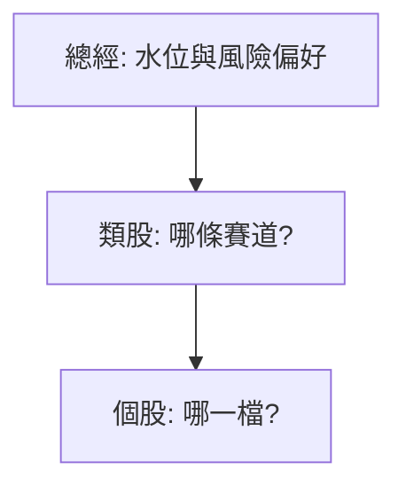

# 總經與類股輪動

## 本篇你會學到

- 總經如何影響「該買哪類股」
- 板塊輪動的觀察與應用
- 與 [基本面框架](../05-analysis/fundamental-framework.md) 宏觀層的實戰延伸

[← 老手專區](index.md)

---

## 兩層決策

老手常跳過 M、S 直接選 P → 選到對的公司但錯的季節。

---

## 總經觀察清單

| 指標 | 偏多環境（簡化） | 偏空環境 |
|------|------------------|----------|
| 利率趨勢 | 降或持平 | 升 |
| 台股大盤 | 月線之上 | 月線之下 |
| 外資流向 | 連續買超 | 連續賣超 |
| [資金行情](../02-glossary/market-terms.md#資金行情) | 熱錢充裕 | 緊縮 |

名詞定義（國債、升息、降息）見 [總經與利率術語](../02-glossary/macro.md)。詳見 [跨市場](../05-analysis/cross-market.md)、[大盤圖](../04-charts/market-charts.md)。

**動作**：總經偏空時，降槓桿、提高現金、縮小衛星部位。

---

## 類股輪動

| 階段 | 常見現象（非公式） |
|------|-------------------|
| 復甦初 | 金融、原物料 |
| 景氣擴張 | 電子、半導體 |
| 過熱 | 投機題材、小型股 |
| 衰退 | 防禦、高股息 |

| 工具 | 用途 |
|------|------|
| 產業漲跌幅排行 | 當週資金偏好 |
| 同業營收比較 | 強者是否集中 |
| [主動 ETF 持股](../05-analysis/active-etf.md) | 機構加碼產業 |

---

## 與個股分析的銜接

| 總經 + 類股 | 個股 |
|-------------|------|
| 電子類強 | 再挑營收、法人佳的個股 |
| 傳產輪動 | 勿死守過時投資論點（thesis） |
| 大盤破線 | 個股再強也縮部位 |

[行業四維度](../05-analysis/fundamental-framework.md#行業層次) 用於判斷賽道生命週期。

## 自我檢查

??? question "1.（概念題）總經輪動的順序口訣是什麼？"
    參考答案：**先海（總經）→ 河道（類股）→ 魚（個股）**。

??? question "2.（判斷題）景氣擴張期只挑電子強勢股，可以完全不顧大盤？"
    參考答案：不行。大盤破線時個股再強也宜**縮部位**；總經是系統性風險。

??? question "3.（情境題）你持有的傳產 thesis 仍好，但資金明顯輪進電子，該怎麼想？"
    參考答案：thesis 要**更新**，不是死抱；可檢視是否減碼弱勢類股、在強勢類股內重找標的。

## 重點回顧

- **先海（總經）→ 河道（類股）→ 魚（個股）**。
- 輪動時 thesis 要更新，不是死抱。
- 延伸：[組合管理](portfolio.md) · [期貨輔助](futures-signal.md)
