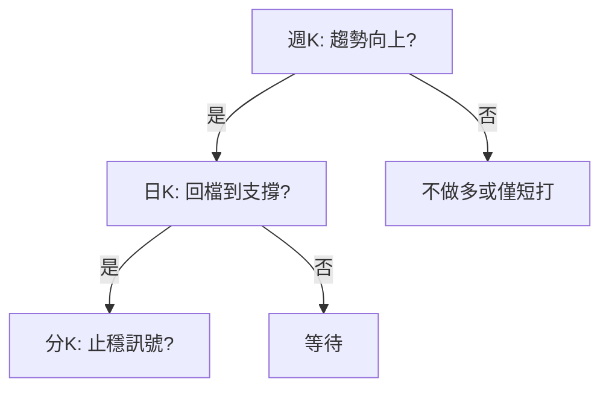

# 多週期整合分析

## 本篇你會學到

- 週、日、分 K 如何同時看而不矛盾
- 「順大逆小」與「三層對齊」法
- 與 [四種時間框架](../05-analysis/timeframes.md) 的進階差異

[← 老手專區](index.md)

---

## 為什麼要整合

新手常犯：**週 K 看多、分 K 看空卻照買**，或 **日 K 破線仍說「長線看好」**。

多週期整合回答：**哪一層決定方向？哪一層決定進場？**

---

## 三層模型

| 層級 | 圖表 | 回答 | 權重 |
|------|------|------|------|
| **戰略層** | 週 K / 月 K | 大方向多或空？ | 最高 |
| **戰術層** | 日 K + 量價 | 現在是進場區還是等待？ | 中 |
| **執行層** | 分 K / 分時 | 具體下單點？ | 最低（但當沖最高） |

---

## 順大逆小

| 原則 | 說明 |
|------|------|
| **順大** | 週線趨勢方向優先 |
| **逆小** | 日內回檔時找買點（順大勢） |
| **禁止** | 週線空頭卻頻繁分 K 搶反彈（除非定義為短打且嚴格停損） |

[中線](../08-investing/swing-mid.md)：**週 K 定方向，日 K 定進場**。  
[當沖](../08-investing/day-trade.md)：**大盤分時定多空，分 K 定進出**（執行層權重提高）。

---

## 三層對齊檢查表

進場前勾選：

| # | 問題 | 是 / 否 |
|---|------|---------|
| 1 | 戰略層（週/月）趨勢與投資論點（thesis）一致？ | |
| 2 | 戰術層（日）位置合理（非極端追高）？ | |
| 3 | 量價配合？ | |
| 4 | 籌碼 3～5 日與方向一致？ | |
| 5 | 大盤環境允許？ | [大盤圖](../04-charts/market-charts.md) |

**5 項中至少 4 項為「是」** 才考慮進場（可依模式調整，但需寫在個人規則裡）。

---

## 與評分四刻度的關係

[評分表](../03-tables/scoring.md) 的當沖/短/中/長分數，可視為**各層的自動化摘要**：

| 現象 | 解讀 |
|------|------|
| 長期高、當沖低 | 適合中長線，不適合盤中頻繁交易 |
| 當沖高、長期低 | 僅短打，勿長抱 |
| 四刻度齊高 | 罕見；仍要寫 thesis，分數非保證 |

## 自我檢查

??? question "1.（概念題）多週期分析「一個方向只能有一個主人」是什麼意思？"
    參考答案：週線或日線依模式決定**主趨勢**；分 K 用來執行，不應推翻主趨勢 thesis（當沖除外）。

??? question "2.（判斷題）進場前 5 項檢查只有 2 項為「是」，可以全倉進場？"
    參考答案：不行。至少 **4/5** 為「是」才考慮進場（或依你寫下的個人規則）。

??? question "3.（情境題）長期分高、當沖分低，適合什麼操作風格？"
    參考答案：適合**中長線**，不適合盤中頻繁交易；見本篇與 [評分表](../03-tables/scoring.md)。

## 重點回顧

- **一個方向**只能有一個主人：週線或日線，依模式決定。
- 分 K 用來**執行**，不該推翻週線 thesis（當沖除外）。
- 延伸：[期貨輔助](futures-signal.md) · [研究流程](research-workflow.md)
