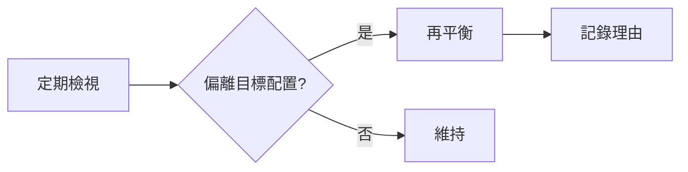

# 組合管理

## 本篇你會學到

- 多檔持股如何配置與再平衡
- 相關性、產業集中風險
- 核心—衛星結構

[← 老手專區](index.md)

---

## 單檔好 ≠ 組合好

老手常同時持有 5～10 檔，問題變成：

| 問題 | 後果 |
|------|------|
| 5 檔都是電子 | 類股崩時全滅 |
| 每檔都滿倉 | 無法加碼真正強勢 |
| 從不賣弱留強 | 組合績效被拖累 |

---

## 核心—衛星

| 部位 | 比例（教學參考） | 內容 |
|------|------------------|------|
| **核心** | 50%～70% | 大盤 ETF、龍頭、高確信投資論點（thesis） |
| **衛星** | 30%～50% | 波段候選、題材、較小部位試單 |

見 [ETF 投資](../08-investing/etf-investing.md)。

---

## 配置檢查

| 維度 | 建議上限（參考） |
|------|------------------|
| 單一標的 | 總資金 25%～30% |
| 單一 [類股](../02-glossary/trading-terms.md#類股) | 40%～50% |
| 同時持倉檔數 | 中線 3～7；當沖 1～3 |
| 現金比例 | 10%～30%（保留彈性） |

基礎見 [資金配置](../06-risk/capital.md)。

---

## 再平衡 {#再平衡}

| 觸發 | 動作 |
|------|------|
| 某檔漲超配置上限 5% | 減碼或 [分批停利](../02-glossary/trading-terms.md#分批) |
| thesis 失效 | 出清，不問成本 |
| 類股輪動 | 減弱勢類、加強勢類（見 [總經輪動](macro-rotation.md)） |
| 每季 | 檢視 PER、營收趨勢是否仍支持持有 |

---

## 相關性（白話）

| 現象 | 說明 |
|------|------|
| 高度相關 | 兩檔同漲同跌（同產業鏈）→ 分散效果低 |
| 低相關 | 金融 + 電子 → 波動可能互補 |

不需算數學相關係數；問自己：**「若台積電跌 5%，我組合裡還有幾檔會一起跌？」**

---

## 與投資模式的關係

| 模式 | 組合重點 |
|------|----------|
| 當沖 | 當日風險上限，非傳統組合 |
| 中線 | 3～5 檔 thesis 驅動 |
| 長線/存股 | 少檔、長抱、股息再投入 |
| ETF 為主 | 股債比例、定期定額 |
| 保單／外幣 | 另類桶比例、與標的配置分開評估（見 [投資型保單](../08-investing/investment-linked-policy.md)、[外幣帳戶](../08-investing/insurance-fx-products.md)） |

---

## 重點回顧

- 組合管理是**老手與新手最大的分水嶺**之一。
- 定期再平衡優於「永遠不賣」。

## 相關

- [研究流程](research-workflow.md) · [老手陷阱](veteran-pitfalls.md) · [資金配置](../06-risk/capital.md)
