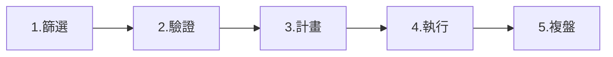

# 系統化研究流程

## 本篇你會學到

- 從發想到出場的完整檢查清單
- 投資論點（thesis）怎麼寫
- 如何用本站各章節填滿流程

[← 老手專區](index.md)

---

## 五步流程



| 步驟 | 產出 | 時間 |
|------|------|------|
| **篩選** | 候選清單 5～15 檔 | 每週 |
| **驗證** | 每檔 thesis 一頁 | 每檔 30～60 分 |
| **計畫** | 進場、停損、停利、部位 | 下單前 |
| **執行** | 依計畫或寫下偏離理由 | 盤中/盤後 |
| **複盤** | 交易日誌、案例化 | 每週 |

---

## Step 1：篩選

| 來源 | 工具 |
|------|------|
| 評分 / 觀察清單（watchlist） | [個股總覽](../03-tables/watchlist.md)、[評分](../03-tables/scoring.md) |
| 類股強勢 | [大盤類股圖](../04-charts/market-charts.md) |
| ETF 共識 | [主動 ETF](../05-analysis/active-etf.md) |
| 營收轉折 | [月營收表](../03-tables/revenue.md) |

**老手規則**：篩選階段**不看分 K**，避免過早陷入進場細節。

---

## Step 2：驗證（thesis 模板）

每檔候選填一頁：

```markdown
## 代號 / 名稱 — 日期

### 模式
中線波段 / 短線 / …

### 看多理由（最多 3 點）
1. 基本面：…
2. 籌碼：…
3. 技術：…

### 看空 / 風險（至少 2 點）
1. …
2. …

### 何時 thesis 失效
- 營收連續 MoM 負且超過 X%
- 法人連續賣超 N 日
- 跌破 Y 價位 / 均線

### 資料來源
月營收 M、法人 5 日、PER …
```

對照 [三大支柱](../05-analysis/three-pillars.md)、[深入分析分頁](../03-tables/deep-dive-tabs.md)。

---

## Step 3：計畫

| 項目 | 參考 |
|------|------|
| 部位大小 | [資金配置](../06-risk/capital.md)、[組合管理](portfolio.md) |
| 停損停利 | [停損三層](../06-risk/stop-loss.md) |
| 成本 | [交易成本](../06-risk/trading-costs.md) |
| 框架 | [投資模式](../08-investing/index.md) 對應專章 |

**必寫**：進場價區間、停損價、第一目標價、持有最長天數。

---

## Step 4：執行紀律

| 允許 | 不允許（除非重寫 thesis） |
|------|---------------------------|
| 分批依計畫加減 | 無停損追高 |
| 觸發失效條件出場 | 虧損後「加碼攤平」無計畫 |
| 寫下偏離計畫的理由 | 忘記當初為何買 |

---

## Step 5：複盤

| 頻率 | 內容 |
|------|------|
| 每筆平倉後 | 是否遵守計畫？偏差原因？ |
| 每週 | 候選池更新、類股輪動檢視 |
| 每月 | [組合](portfolio.md) 再平衡、總經檢視 |

將真實交易改寫成 [案例](../07-cases/revenue-turn.md) 格式，是進步最快的方式。

---

## 重點回顧

- 老手靠**流程**降低隨機性；thesis 可寫可改，但必須存在。
- 各章節是流程的**模組**，不是散裝知識。
- 下一步：[多週期整合](multi-timeframe.md)
