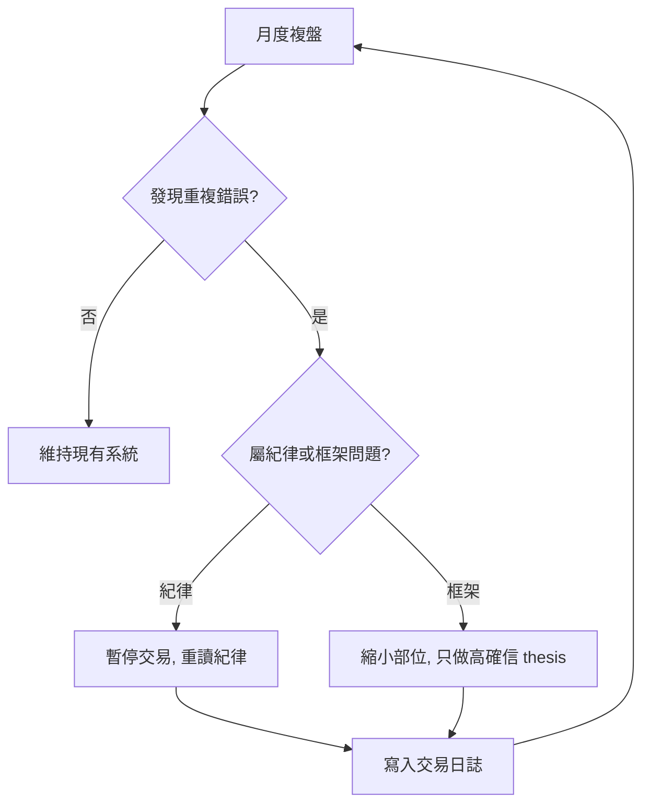

# 老手常見陷阱

## 本篇你會學到

- 有基礎後仍常犯的進階錯誤
- 自我檢核表
- 如何回到正軌

[← 老手專區](index.md)

---

## 十大陷阱

| # | 陷阱 | 後果 | 對策 |
|---|------|------|------|
| 1 | **過度交易** | 成本吃掉獲利 | [交易成本](../06-risk/trading-costs.md)、減少無投資論點（thesis）的單 |
| 2 | **框架混用** | 短線進長線抱 | [多週期](multi-timeframe.md)、寫持有天數 |
| 3 | **錨定成本** | 套牢不認賠 | thesis 失效就出場 |
| 4 | **確認偏誤** | 只看利多忽略風險 | thesis 必填「看空 2 點」 |
| 5 | **分數崇拜** | 評分高就重倉 | [評分](../03-tables/scoring.md) 僅粗篩 |
| 6 | **類股過度集中** | 一業崩全組合傷 | [組合管理](portfolio.md) |
| 7 | **事件賭博** | 法說當天 all in | [事件手冊](event-playbook.md) |
| 8 | **追逐新指標** | 永遠在換方法 | 固定 [研究流程](research-workflow.md) |
| 9 | **忽略總經** | 逆風選強股 | [總經輪動](macro-rotation.md) |
| 10 | **不複盤** | 重複同錯 | 案例化交易日誌 |

---

## 月度自檢

| 問題 | 是 → 行動 |
|------|------------|
| 上月交易次數是否遠超計畫？ | 收斂模式、提高進場門檻 |
| 是否有「說不出為何買」的庫存？ | 補 thesis 或減碼 |
| 組合是否 >50% 同一類股？ | 再平衡 |
| 停損是否連續未執行？ | 暫停交易 1 週，重讀 [紀律](../06-risk/discipline.md) |

---

## 績效平臺期

| 階段 | 建議 |
|------|------|
| 連續 3 月無進步 | 縮小部位、只做最高確信 thesis |
| 連續虧損 | 降槓桿、檢討是否框架混用 |
| 連續獲利 | 警惕過度自信，勿放大部位 |

## 自我檢查

??? question "1.（概念題）老手虧損多半來自什麼，而不是少懂一個指標？"
    參考答案：**紀律與系統**——過度交易、框架混用、確認偏誤等行為問題。

??? question "2.（判斷題）連續獲利三個月，可以因此放大部位、放寬停損？"
    參考答案：不應。連續獲利更要警惕**過度自信**；部位應依計畫，非依近期運氣。

??? question "3.（情境題）月度複盤發現「短線進場卻長線死抱」，屬哪類問題？"
    參考答案：**框架混用**；應縮小部位、只做高確信 thesis，或重讀 [交易紀律](../06-risk/discipline.md)。

## 重點回顧

- 老手虧損多來自**紀律與系統**，不是少懂一個指標。
- 每月用本表自檢一次。

## 相關

- [老手專區總覽](index.md) · [研究流程](research-workflow.md) · [交易紀律](../06-risk/discipline.md)
