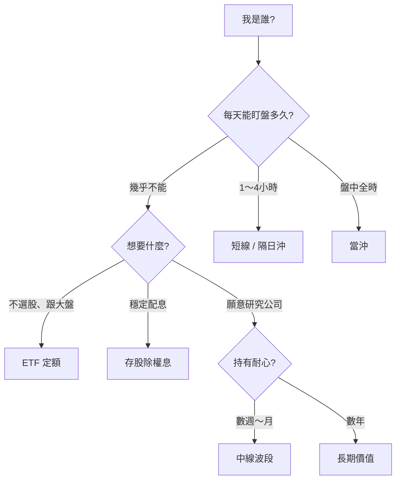

# 我是誰，該怎麼投？

> **對號入座** — 不用測驗、不用打分，找到最像你的那一格，照著走就好。

## 本篇你會學到

- 依**身分與生活型態**對應建議的投資模式
- 每種身分「適合 / 不適合 / 第一步 / 心態提醒」
- 與 [投資模式專章](../08-investing/index.md) 的連結路徑

| 頁面 | 適合你嗎 | 本篇定位 |
|------|----------|----------|
| **本篇** | 用「上班族、學生、退休族…」形容自己較順 | **身分圖鑑** |
| [如何選模式](../08-investing/choose-style.md) | 想依時間、隔夜風險、紀律五問篩選，並要 30 天計畫 | **問卷式篩選** |

!!! warning "免責聲明"
    以下為**教學情境分類**，像朋友聊天時的建議方向，**不構成投資建議**，亦不保證獲利。請依個人財務狀況自行判斷。

[← 投資模式總覽](../08-investing/index.md) · [如何選模式](../08-investing/choose-style.md) · [模式與心態](../08-investing/mode-psychology.md)

---

## 30 秒找到你的格子

| 一句話形容自己 | 跳到 |
|----------------|------|
| 上班沒空看盤 | [① 忙碌上班族](busy.md#①-忙碌上班族) |
| 盤中都能盯 | [② 全職盯盤族](active.md#②-全職盯盤族) |
| 完全零基礎 | [③ 股市萌新](beginner.md#③-股市萌新) |
| 就想領股息 | [④ 配息派](steady.md#④-配息派) |
| 愛看財報法說 | [⑤ 研究狂人](steady.md#⑤-研究狂人) |
| 資金不大 | [⑥ 小資起步族](beginner.md#⑥-小資起步族) |
| 快退休或已退休 | [⑦ 準退休／退休族](steady.md#⑦-準退休退休族) |
| 常追高、怕錯過 | [⑧ FOMO 追風族](active.md#⑧-fomo-追風族) |
| 以前賠過想重來 | [⑨ 重生玩家](active.md#⑨-重生玩家) |
| 有正職但想偶爾短打 | [⑩ 斜槓短打族](busy.md#⑩-斜槓短打族) |
| 還在讀書、資金少 | [⑪ 在學學生族](beginner.md#⑪-在學學生族) |
| 管家裡開銷與存款 | [⑫ 家計掌權者](busy.md#⑫-家計掌權者) |

---

## 身分圖鑑（12 型）

12 種身分依生活型態分為四組，點進去看「適合 / 不適合 / 第一步 / 心態」完整卡片：

| 分組 | 收錄身分 |
|------|----------|
| [新手・小資・學生](beginner.md) | ③ 股市萌新 · ⑥ 小資起步族 · ⑪ 在學學生族 |
| [上班・斜槓・家計](busy.md) | ① 忙碌上班族 · ⑩ 斜槓短打族 · ⑫ 家計掌權者 |
| [盯盤・追風・重生](active.md) | ② 全職盯盤族 · ⑧ FOMO 追風族 · ⑨ 重生玩家 |
| [配息・研究・退休](steady.md) | ④ 配息派 · ⑤ 研究狂人 · ⑦ 準退休／退休族 |

---

## 一張表對照全身分

| 身分 | 建議主模式 | 盯盤頻率 | 必讀一章 |
|------|------------|----------|----------|
| 忙碌上班族 | 中線 / ETF | 每週 1 次 | [中線](../08-investing/swing-mid.md) |
| 全職盯盤 | 當沖 / 隔日沖 | 盤中 | [當沖](../08-investing/day-trade.md) · [隔日沖](../08-investing/overnight.md) |
| 股市萌新 | ETF 定額 | 每月定額日 | [0050 專章](../08-investing/etf-passive-dca.md) · [案例](../07-cases/etf-dca-drawdown.md) |
| 配息派 | 存股除權息 | 除息日程 | [存股](../08-investing/dividend-investing.md) |
| 研究狂人 | 長期價值 | 季報法說 | [長期](../08-investing/long-term.md) |
| 小資起步 | ETF 定額 | 每月 | [交易成本](../06-risk/trading-costs.md) |
| 準退休族 | 存股 + ETF | 每月 | [資金配置](../06-risk/capital.md) |
| FOMO 族 | ETF 定額（先） | 少盯盤 | [交易紀律](../06-risk/discipline.md) |
| 重生玩家 | ETF / 中線小倉 | 每週 | [心態錯配](../08-investing/mode-psychology.md#心態錯配) |
| 斜槓短打 | 短線 / 隔日沖 | 關鍵時段 | [短線](../08-investing/swing-short.md) · [隔日沖](../08-investing/overnight.md) |
| 在學學生 | ETF 定額（小額） | 每月定額日 | [0050 專章](../08-investing/etf-passive-dca.md) · [入門](../01-basics/index.md) |
| 家計掌權 | ETF + 存股 | 每月檢視 | [資金配置](../06-risk/capital.md) · [閒錢](../08-investing/etf-passive-dca.md#為什麼強調閒錢) |

---

## 找到格子之後

1. **讀對應專章** — 上表「必讀一章」
2. **對照心態** — [投資模式與心態](../08-investing/mode-psychology.md)
3. **走學習地圖** — [模式學習地圖](../08-investing/index.md#模式學習地圖融會貫通)
4. **至少 30 天** — 不要週一當沖、週三存股、週五定額

| 還不確定？ | 去做 |
|------------|------|
| 要 30 天計畫 | [各模式週次表](../08-investing/choose-style.md#30-天學習計畫) |
| 介於兩型之間 | [五個自問](../08-investing/choose-style.md#五個自問) |
| 想更系統化 | [老手專區](../09-advanced/index.md) |
| 要查名詞 | [字典](../02-glossary/dictionary.md) |

---

## 重點回顧

- **對號入座**不是貼標籤，是幫你少繞路。
- 沒有「最賺的模式」，只有**最適合你時間、心理與資金**的模式。
- 九成新手從 [ETF 定額](../08-investing/etf-passive-dca.md) 或 [中線](../08-investing/swing-mid.md) 開始都合理。
- 下一步：點上方你的身分 → 進專章 → 案例驗證。

相關：[投資模式總覽](../08-investing/index.md) · [如何選模式](../08-investing/choose-style.md) · [首頁學習路徑](../index.md)
