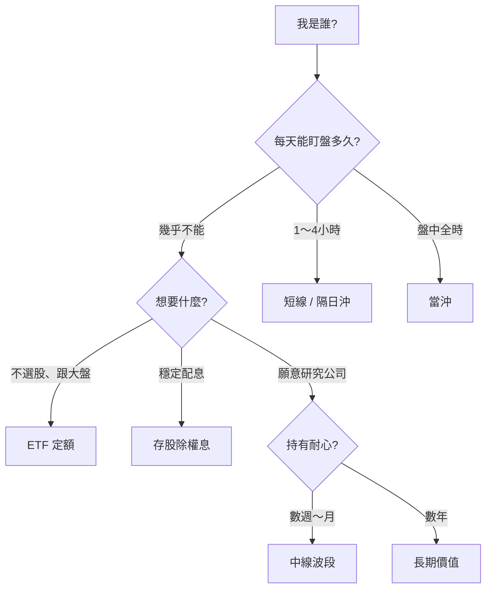

# 我是誰，該怎麼投？

> **對號入座** — 不用測驗、不用打分，找到最像你的那一格，照著走就好。

## 本篇你會學到

- 依**身分與生活型態**對應建議的投資模式
- 每種身分「適合 / 不適合 / 第一步 / 心態提醒」
- 與 [投資模式專章](../08-investing/index.md) 的連結路徑

| 頁面 | 適合你嗎 | 本篇定位 |
|------|----------|----------|
| **本篇** | 用「上班族、學生、退休族…」形容自己較順 | **身分圖鑑** |
| [如何選模式](../08-investing/choose-style.md) | 想依時間、隔夜風險、紀律五問篩選，並要 30 天計畫 | **問卷式篩選** |

!!! warning "免責聲明"
    以下為**教學情境分類**，像朋友聊天時的建議方向，**不構成投資建議**，亦不保證獲利。請依個人財務狀況自行判斷。

[← 投資模式總覽](../08-investing/index.md) · [如何選模式](../08-investing/choose-style.md) · [模式與心態](../08-investing/mode-psychology.md)

---

## 30 秒找到你的格子

| 一句話形容自己 | 跳到 |
|----------------|------|
| 上班沒空看盤 | [① 忙碌上班族](#①-忙碌上班族) |
| 盤中都能盯 | [② 全職盯盤族](#②-全職盯盤族) |
| 完全零基礎 | [③ 股市萌新](#③-股市萌新) |
| 就想領股息 | [④ 配息派](#④-配息派) |
| 愛看財報法說 | [⑤ 研究狂人](#⑤-研究狂人) |
| 資金不大 | [⑥ 小資起步族](#⑥-小資起步族) |
| 快退休或已退休 | [⑦ 準退休／退休族](#⑦-準退休退休族) |
| 常追高、怕錯過 | [⑧ FOMO 追風族](#⑧-fomo-追風族) |
| 以前賠過想重來 | [⑨ 重生玩家](#⑨-重生玩家) |
| 有正職但想偶爾短打 | [⑩ 斜槓短打族](#⑩-斜槓短打族) |
| 還在讀書、資金少 | [⑪ 在學學生族](#⑪-在學學生族) |
| 管家裡開銷與存款 | [⑫ 家計掌權者](#⑫-家計掌權者) |

---

## 身分圖鑑（12 型）

### ① 忙碌上班族 {#①-忙碌上班族}

| | |
|---|---|
| **你是這型如果…** | 白天開會、開盤多半在忙；下班只想快速看一下 |
| **建議主模式** | **[中線波段](../08-investing/swing-mid.md)** 或 **[ETF 定期定額](../08-investing/etf-passive-dca.md)** |
| **次選** | [存股除權息](../08-investing/dividend-investing.md)（若重配息） |
| **不建議** | [當沖](../08-investing/day-trade.md)、[隔日沖](../08-investing/overnight.md) — 沒時間執行紀律 |
| **第一步** | 週末固定 1 次看 [月營收](../03-tables/revenue.md) + 週 K；或開 [0050 定額](../08-investing/etf-passive-dca.md) |
| **心態** | 平日少看分 K；用 [每週檢視](../08-investing/mode-psychology.md#中線心態) 取代盤中焦慮 |

---

### ② 全職盯盤族 {#②-全職盯盤族}

| | |
|---|---|
| **你是這型如果…** | 9:00～13:30 都能在螢幕前；能接受當日輸贏 |
| **建議主模式** | **[當沖](../08-investing/day-trade.md)** 或 **[隔日沖](../08-investing/overnight.md)** |
| **次選** | [短線](../08-investing/swing-short.md)（若不想每天歸零） |
| **不建議** | 用當沖技巧卻 [長線死抱](../08-investing/mode-psychology.md#心態錯配) |
| **第一步** | 算清 [交易成本](../06-risk/trading-costs.md) + 設 [每日風險上限](../06-risk/capital.md#每日風險預算) |
| **心態** | 今日輸贏今日了；見 [當沖心態](../08-investing/mode-psychology.md#當沖心態) |

---

### ③ 股市萌新 {#③-股市萌新}

| | |
|---|---|
| **你是這型如果…** | K 線、本益比、除權息都還在學；不想一開始就複雜選股 |
| **建議主模式** | **[ETF 定期定額（0050）](../08-investing/etf-passive-dca.md)** |
| **學習並行** | [入門導覽](../01-basics/index.md) → [ETF 入門](../01-basics/etf-intro.md) → [圖表總覽](../04-charts/index.md) |
| **不建議** | 聽消息買個股、當沖、融資滿檔 |
| **第一步** | 確認是 [閒錢](../06-risk/capital.md#閒錢與生活費) → 開定額 → 同時讀 [三大支柱](../05-analysis/three-pillars.md) |
| **心態** | 先建立紀律，再談超額報酬；見 [ETF 心態](../08-investing/mode-psychology.md#etf心態) |

---

### ④ 配息派 {#④-配息派}

| | |
|---|---|
| **你是這型如果…** | 最在意「每年現金流進帳」；能接受股價起伏換取股息 |
| **建議主模式** | **[存股除權息](../08-investing/dividend-investing.md)** |
| **次選** | 高股息 ETF（仍要看內扣費與成分） |
| **不建議** | 除息前 [搶息追高](../08-investing/mode-psychology.md#存股心態)；把殖利率當定存利率 |
| **第一步** | 讀 [除權息入門](../01-basics/dividend.md) → 查 [除權息日程](../03-tables/dividend-schedule.md) → 看 [填息案例](../07-cases/dividend-play.md) |
| **心態** | 配息品質 > 殖利率數字；除息下修是正常流程 |

---

### ⑤ 研究狂人 {#⑤-研究狂人}

| | |
|---|---|
| **你是這型如果…** | 願意讀財報、聽法說、追產業；享受搞懂一家公司 |
| **建議主模式** | **[長期價值投資](../08-investing/long-term.md)** |
| **次選** | [中線波段](../08-investing/swing-mid.md)（若仍想數月調節） |
| **不建議** | 每天看分 K 被洗出去；研究 10 檔同時持有 |
| **第一步** | [基本面框架](../05-analysis/fundamental-framework.md) → [財報表](../03-tables/financials.md) → 寫下 thesis |
| **心態** | 賣看 thesis 失效，非只看跌幾 %；見 [長期心態](../08-investing/mode-psychology.md#長期心態) |

---

### ⑥ 小資起步族 {#⑥-小資起步族}

| | |
|---|---|
| **你是這型如果…** | 可投資金額有限（例如每月幾千～一兩萬）；想慢慢累積 |
| **建議主模式** | **[ETF 定期定額](../08-investing/etf-passive-dca.md)** |
| **次選** | [中線](../08-investing/swing-mid.md) 1 檔集中研究（張數少、成本低） |
| **不建議** | [當沖](../08-investing/day-trade.md) — 成本占比易吃掉獲利 |
| **第一步** | [交易成本](../06-risk/trading-costs.md) 試算 → 定額金額訂在「虧了也不影響生活」 |
| **心態** | 小資的優勢是時間；用 [閒錢](../08-investing/etf-passive-dca.md#為什麼強調閒錢) 換複利空間 |

---

### ⑦ 準退休／退休族 {#⑦-準退休退休族}

| | |
|---|---|
| **你是這型如果…** | 重視資產保值與穩定現金流；承受波動能力可能較低 |
| **建議主模式** | **[存股除權息](../08-investing/dividend-investing.md)** + **[ETF 配置](../08-investing/etf-investing.md)** 並行 |
| **不建議** | 高槓桿短線、把生活費投入股市 |
| **第一步** | [資金配置](../06-risk/capital.md) 盤點 → 股債比例 → 高品質配息標的 |
| **心態** | 流動性優先：確保 [不被迫低點賣出](../06-risk/capital.md#閒錢與生活費) |

---

### ⑧ FOMO 追風族 {#⑧-fomo-追風族}

| | |
|---|---|
| **你是這型如果…** | 看到漲停就想追、新聞一出就買、怕錯過任何題材 |
| **建議主模式** | 先 **[ETF 定額](../08-investing/etf-passive-dca.md)** 建立紀律，再考慮 [中線](../08-investing/swing-mid.md) |
| **不建議** | [當沖](../08-investing/day-trade.md)、追漲停短打 — 會放大 FOMO |
| **第一步** | [交易日誌](../06-risk/discipline.md#交易日誌建議) + 寫「沒計畫就不追」清單 |
| **心態** | 質優於量；見 [心態錯配](../08-investing/mode-psychology.md#心態錯配) 與 [交易紀律](../06-risk/discipline.md) |

!!! tip "誠實面對自己"
    承認自己是 FOMO 型，本身就是進步。用**機械化定額**減少臨場衝動，比硬學當沖安全得多。

---

### ⑨ 重生玩家 {#⑨-重生玩家}

| | |
|---|---|
| **你是這型如果…** | 以前賠過、套牢過；想重新來但怕重蹈覆轍 |
| **建議主模式** | **[ETF 定額](../08-investing/etf-passive-dca.md)** 或 **[中線](../08-investing/swing-mid.md)**（小部位） |
| **不建議** | 急著「這次一定要扳回來」→ 報復性交易 |
| **第一步** | 檢討過去是 [心態錯配](../08-investing/mode-psychology.md#心態錯配) 還是方法問題 → [停損三層](../06-risk/stop-loss.md) |
| **心態** | 小虧是學費；先求**活下來**再求獲利。見 [老手誤區](../09-advanced/veteran-pitfalls.md) |

---

### ⑩ 斜槓短打族 {#⑩-斜槓短打族}

| | |
|---|---|
| **你是這型如果…** | 有正職，但午休或早盤能抽 1～2 小時；想偶爾短打不加碼長抱 |
| **建議主模式** | **[短線](../08-investing/swing-short.md)** 或 **[隔日沖](../08-investing/overnight.md)** |
| **主倉建議** | 核心仍可用 [ETF](../08-investing/etf-investing.md) 或 [中線](../08-investing/swing-mid.md) 部位 |
| **不建議** | 開會錯過出場卻 [變成短線死抱](../08-investing/mode-psychology.md#心態錯配) |
| **第一步** | 核心衛星配置 → 短打部位設 [嚴格停損](../06-risk/stop-loss.md) 與筆數上限 |
| **心態** | 短打是「加料」，不是全部身家；見 [短線心態](../08-investing/mode-psychology.md#短線心態) |

---

### ⑪ 在學學生族 {#⑪-在學學生族}

| | |
|---|---|
| **你是這型如果…** | 還在就學；可投資金額少（每月幾百～幾千）；上課無法盯盤 |
| **建議主模式** | **[ETF 定期定額](../08-investing/etf-passive-dca.md)**（金額從小開始） |
| **學習並行** | [入門導覽](../01-basics/index.md) + [圖表總覽](../04-charts/index.md) — 當「金融通識」累積 |
| **不建議** | 借錢投資、當沖、把生活費或學費投進去 |
| **第一步** | 先劃出「絕對不動用」的生活費 → 剩餘才定額；見 [閒錢](../06-risk/capital.md#閒錢與生活費) |
| **心態** | 優勢是**時間長**；目標是建立紀律與觀念，不是短期暴富 |

!!! tip "學生族常見誤區"
    「資金少沒意義」— 定期定額的價值在**習慣**；金額可從 500、1000 元起，重點是持續與閒錢。

---

### ⑫ 家計掌權者 {#⑫-家計掌權者}

| | |
|---|---|
| **你是這型如果…** | 負責房租、伙食、小孩學費、家庭預備金；想幫家人理財 |
| **建議主模式** | **[ETF 配置](../08-investing/etf-investing.md)** + **[存股除權息](../08-investing/dividend-investing.md)**（偏穩定現金流） |
| **次選** | 家庭 [0050 定額](../08-investing/etf-passive-dca.md)（僅用**家庭閒錢帳**） |
| **不建議** | 把家用、緊急預備金混入股市；家人各自盯盤情緒化 |
| **第一步** | 畫清三筆錢：**生活費／緊急預備／投資閒錢** → [資金配置](../06-risk/capital.md) |
| **心態** | 家庭帳戶首重**流動性**；投資閒錢才進股市，避免 [認賠殺出](../06-risk/capital.md#閒錢與生活費) |

!!! warning "家計與投資要分帳"
    建議投資用**獨立帳戶**或明確子帳目，避免「這筆到底能不能動」在急用錢時造成低點變現。

---

## 一張表對照全身分

| 身分 | 建議主模式 | 盯盤頻率 | 必讀一章 |
|------|------------|----------|----------|
| 忙碌上班族 | 中線 / ETF | 每週 1 次 | [中線](../08-investing/swing-mid.md) |
| 全職盯盤 | 當沖 / 隔日沖 | 盤中 | [當沖](../08-investing/day-trade.md) · [隔日沖](../08-investing/overnight.md) |
| 股市萌新 | ETF 定額 | 每月定額日 | [0050 專章](../08-investing/etf-passive-dca.md) · [案例](../07-cases/etf-dca-drawdown.md) |
| 配息派 | 存股除權息 | 除息日程 | [存股](../08-investing/dividend-investing.md) |
| 研究狂人 | 長期價值 | 季報法說 | [長期](../08-investing/long-term.md) |
| 小資起步 | ETF 定額 | 每月 | [交易成本](../06-risk/trading-costs.md) |
| 準退休族 | 存股 + ETF | 每月 | [資金配置](../06-risk/capital.md) |
| FOMO 族 | ETF 定額（先） | 少盯盤 | [交易紀律](../06-risk/discipline.md) |
| 重生玩家 | ETF / 中線小倉 | 每週 | [心態錯配](../08-investing/mode-psychology.md#心態錯配) |
| 斜槓短打 | 短線 / 隔日沖 | 關鍵時段 | [短線](../08-investing/swing-short.md) · [隔日沖](../08-investing/overnight.md) |
| 在學學生 | ETF 定額（小額） | 每月定額日 | [0050 專章](../08-investing/etf-passive-dca.md) · [入門](../01-basics/index.md) |
| 家計掌權 | ETF + 存股 | 每月檢視 | [資金配置](../06-risk/capital.md) · [閒錢](../08-investing/etf-passive-dca.md#為什麼強調閒錢) |

---

## 找到格子之後

1. **讀對應專章** — 上表「必讀一章」
2. **對照心態** — [投資模式與心態](../08-investing/mode-psychology.md)
3. **走學習地圖** — [模式學習地圖](../08-investing/index.md#模式學習地圖融會貫通)
4. **至少 30 天** — 不要週一當沖、週三存股、週五定額

| 還不確定？ | 去做 |
|------------|------|
| 要 30 天計畫 | [各模式週次表](../08-investing/choose-style.md#30-天學習計畫) |
| 介於兩型之間 | [五個自問](../08-investing/choose-style.md#五個自問) |
| 想更系統化 | [老手專區](../09-advanced/index.md) |
| 要查名詞 | [字典](../02-glossary/dictionary.md) |

---

## 重點回顧

- **對號入座**不是貼標籤，是幫你少繞路。
- 沒有「最賺的模式」，只有**最適合你時間、心理與資金**的模式。
- 九成新手從 [ETF 定額](../08-investing/etf-passive-dca.md) 或 [中線](../08-investing/swing-mid.md) 開始都合理。
- 下一步：點上方你的身分 → 進專章 → 案例驗證。

相關：[投資模式總覽](../08-investing/index.md) · [如何選模式](../08-investing/choose-style.md) · [首頁學習路徑](../index.md)
