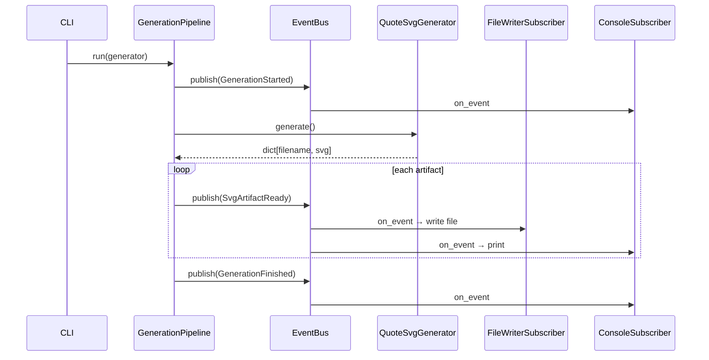

# 架構說明 — SOLID 與 Pub/Sub

本專案可拆為兩層：**MkDocs 靜態教材**（`docs/`）與 **SVG 圖表產生器**（`scripts/stock_school/`）。程式架構遵循 SOLID，並以 **Publish/Subscribe** 解耦「產圖」與「寫檔／日誌」。

## 分層總覽

```
scripts/stock_school/
├── core/           # EventBus、事件、Protocol（DIP / ISP）
├── domain/         # Bar 等領域模型
├── data/           # TwseDataSource（SRP：僅抓資料）
├── indicators/     # IndicatorCalculator（SRP：純計算）
├── render/         # SVG 繪製（SRP：僅渲染）
├── generators/     # 各類圖表產生器（OCP：新增 generator 不改 pipeline）
├── subscribers/    # 訂閱者：寫檔、主控台（SRP）
├── services/       # GenerationPipeline（Publisher）
└── cli.py          # 組裝依賴、啟動流程
```

## SOLID 對照

| 原則 | 實作 |
|------|------|
| **S** 單一職責 | 資料抓取、指標計算、SVG 繪製、寫檔、日誌各自獨立模組 |
| **O** 開放封閉 | 新增 `SvgGenerator` 實作即可擴充圖表類型，無需改 `GenerationPipeline` |
| **L** 里氏替換 | `TwseDataSource` 可替換為其他 `MarketDataSource` 實作 |
| **I** 介面隔離 | `MarketDataSource`、`EventSubscriber` 等小介面，不強迫實作無關方法 |
| **D** 依賴反轉 | Pipeline / Generators 依賴 `Protocol`，不依賴 TWSE 或檔案系統細節 |

## Publish/Subscribe 流程



### 事件類型

- `GenerationStarted` — 某 generator 開始
- `SvgArtifactReady` — 單一 SVG 已產出（含路徑與內容）
- `GenerationFinished` — 批次完成（含檔案數）
- `GenerationError` — 錯誤（可擴充訂閱者處理）
- `PipelineCompleted` — 全部 generator 執行完畢

內建訂閱者 `MkdocsHintSubscriber`（`--hint-serve`）示範如何在不改 pipeline 的情況下擴充行為。

## 使用方式

```bash
# 產生全部 SVG
uv run python scripts/generate_all.py

# 只產生某一類
uv run python scripts/generate_all.py --only quotes
uv run python scripts/generate_all.py --only candles
uv run python scripts/generate_all.py --only indicators
uv run python scripts/generate_all.py --only cases
```

舊腳本 `gen_quote_charts.py` 等仍可使用，內部已委派至同一 pipeline。

## MkDocs 教材層

`docs/` 為 Markdown 靜態內容，**不強制**套用程式層 Pub/Sub；內容以「詞典 → 專章 → 速查」三層與**交叉連結**管理冗餘：

| 主題 | 權威來源（canonical） | 其他章節 |
|------|----------------------|----------|
| 0050 定額、常見說法 | `08-investing/etf-passive-dca.md` | `etf-intro` 只摘要 + 連結 |
| 006208 對照、三層費用 | `01-basics/etf-costs-and-premium.md` | 不重複表格 |
| 閒錢、認賠殺出 | `06-risk/capital.md` | ETF 章只連結 |
| 證交稅、損益平衡、期望值 | `06-risk/trading-costs.md#費用結構` | `settlement-fees` 只講 T+2 與扣款時點 |
| ETF 三層費用、折溢價、收益平準金 | `01-basics/etf-costs-and-premium.md` | `trading-costs` 只列賣出稅率；`etf-high-dividend` 誤解 3 只連結 |
| 基金 vs ETF vs 個股 | `01-basics/mutual-fund-intro.md#基金-vs-etf-vs-個股` | `etf-intro` 只列個股 vs ETF 摘要 |
| 存股除權息 | `08-investing/dividend-investing.md` | 模式總述 |
| 配股配息五策略 | `08-investing/dividend-strategies.md` | 滾息、填息、現金流等實戰框架 |
| 全站學習路徑 | `docs/index.md` | 各章 `index` 只列本章順序 |

全站路徑見 [首頁](index.md)；入門章見 [入門導覽](01-basics/index.md)。

若要擴充訂閱者（例如 CI 上傳、統計報表），實作 `EventSubscriber.on_event` 並在 `cli._build_bus()` 註冊即可，無需修改 generator 或 render 模組。
