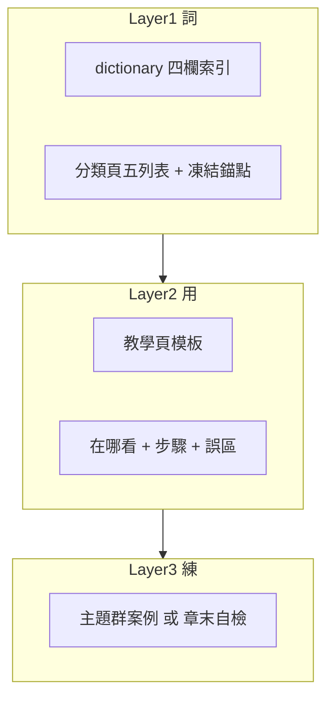

# 寫作規範（維護者）

本頁是 Stock School 教材的**唯一寫作依據**，供維護者與貢獻者在新增或潤稿時參考。學員可略過本頁。

!!! note "定位"
    本頁規範「怎麼寫」，內容權威來源（哪一章是某主題的主檔）請見 [架構說明](ARCHITECTURE.md) 的 canonical 對照表。

---

## 頁面模板（教學頁）

每篇教學頁建議遵循以下骨架：

```markdown
# 標題

## 本篇你會學到

- 3～5 條可驗收的學習目標

---

（正文：表格 / admonition / mermaid）

---

## 重點回顧

- 2～4 條關鍵收斂

## 相關

- [連結一](...) · [連結二](...)
```

例外頁（不套用此模板）：

- [首頁](index.md)：學習路徑導覽。
- [完整詞條總表](02-glossary/dictionary.md)：字典索引。
- [免責聲明](appendix/disclaimer.md)：法務條款。
- [架構說明](ARCHITECTURE.md)、本頁：開發者文件。

### 詞典分類頁子模板

每個術語小節固定為**五列表格**：**英文 → 定義 → 在哪裡看到 → 常見誤解 → 小例子**，並連到對應教學章。詳見下方 [詞典格式規範](#詞典格式規範詞條與索引)。

### 案例頁子模板

**背景 → 看到的表／圖 → 推理步驟（含 mermaid）→ 結論（教學用）→ 反思 → 重點回顧**，並附免責聲明。案例標題統一加編號（案例一、案例二……）。

---

## 教學覆蓋 A 級標準 {#教學覆蓋-a-級標準}

本站以「**可學會、可帶走、可自檢**」為內容驗收標準。每個主題依三層覆蓋評級，目標是全站達 **A 級**。



| 等級 | 條件 |
|------|------|
| **A** | 詞典五列表 + canonical 教學頁（步驟、誤區、相關連結）+ 主題群案例或章末自檢 |
| **B** | 詞典 + 教學頁有步驟，但缺案例／自檢，或缺實務「在哪看」 |
| **C** | 僅有詞條／公式，延伸頁偏速查 |
| **D** | 僅正文散落提及，無獨立詞條或無教學結構 |
| **E** | 站內未覆蓋 |

評級紀錄於 [內容覆蓋矩陣](CONTENT-COVERAGE-MATRIX.md)，每次新增或潤稿後更新。

### 邊界主題（C 級即達標，不追求操作 A） {#邊界主題c-級即達標不追求操作-a}

下列主題**刻意只做定義 + 邊界 + 外部指引**，不寫成完整操作教學：

| 主題 | 處理方式 |
|------|----------|
| 選擇權／期權 | 定義 + 與現股差異 +「本站不教操作」 |
| 綜所稅／扣繳憑單申報 | [稅費總覽](appendix/taxes-for-costing.md) 做成本試算；另指「何時找會計師、站外查什麼」 |
| 券商 APP 逐步截圖 | 以文字步驟 + [深入分析分頁地圖](03-tables/deep-dive-tabs.md) 代替 |

### 看表頁 A 模板 {#看表頁-a-模板}

`03-tables/` 的教學頁（index 除外）統一採以下骨架，缺一即未達 A：

```markdown
# 〇〇表怎麼看

## 本篇你會學到
- 3～5 條學習目標

## 示意表
（教學用合成數據，標明非即時行情）

## 欄位解讀
| 欄位 | 意義 | 怎麼用 |

## 在哪裡看到
（公開資訊觀測站、看盤軟體分頁、資料來源 → 連 appendix/data-sources.md）

## 手算一例
（用示意表其中一列，把公式算給讀者看）

## 閱讀步驟
（編號步驟 + mermaid 流程）

## 常見誤區
| 誤區 | 正確做法 |

## 讀完請做
（強制導向對應實戰案例或章末自檢）

## 重點回顧 + 相關
```

canonical 範本見 [月營收表](03-tables/revenue.md) 與 [估值表](03-tables/valuation.md)。

### 章末自檢題模板 {#章末自檢題模板}

非看表的教學頁若無對應案例，於「重點回顧」前加 **3 題自檢**（概念、判斷、情境各一），用摺疊式解答：

```markdown
## 自我檢查

??? question "1. （概念題）……？"
    參考答案：……

??? question "2. （判斷題）下列哪一項……？"
    參考答案：……

??? question "3. （情境題）若……你會怎麼做？"
    參考答案：……（連結對應章節）
```

---

## 術語對照表

正文一律使用「統一用語」欄。英文術語只在**首次出現**時以括號標註一次，其後使用中文。

| 統一用語 | 不要這樣寫 | 備註 |
|----------|------------|------|
| 定期定額 | ETF 定額、定額 | 英文首次括註「（DCA）」一次即可 |
| 紅K、黑K、大紅K | 紅 K、黑 K、大紅 K（含空格） | 與 SVG 的 aria-label 一致，K 前不空格 |
| 投資論點（thesis） | 裸寫 thesis | 首次出現括註並連至 [研究流程](09-advanced/research-workflow.md) |
| 觀察清單（watchlist） | 裸寫 watchlist | 首次出現括註一次 |
| 當沖 | 當日沖銷 | 首次可寫「當沖（當日沖銷）」，其後統一「當沖」 |
| 台股、平台期 | 臺股、平臺期 | 全站跟隨「台」字 |
| 三類 | 三类 | 避免簡體字 |

!!! tip "新增術語時"
    若引入新的術語，請同步更新四處：[完整詞條總表](02-glossary/dictionary.md)（含英文欄）、對應分類頁（五列表格）、本頁術語對照表，以及（若為縮寫）[縮寫對照](appendix/abbreviations.md)。

---

## 詞典格式規範（詞條與索引） {#詞典格式規範詞條與索引}

本節規範 [術語詞典](02-glossary/index.md) 的呈現格式。**正文教學頁不適用本節**，仍依上方術語對照表「英文僅首次括註」。詞典是中英對照場域，不受「禁止裸英文」限制。

### 分類詳解頁：五列表格

每個 `##` 詞條小節固定如下結構，缺資料時填「—」而非刪列：

```markdown
## 軋空（Short Squeeze） {#軋空}

| 項目 | 說明 |
|------|------|
| **英文** | Short squeeze |
| **定義** | 空頭（常透過融券或借券）被迫買回平倉，推升股價的連鎖反應 |
| **在哪裡看到** | 融資融券表、新聞「融券回補」、鉅額買超 |
| **常見誤解** | 融券多就一定會軋空；還需看借券成本與基本面 |
| **小例子** | 融券餘額高 + 法人大買 → 空頭回補推升股價 |
```

- 相關連結、`admonition`、`mermaid`、子表格等延伸內容放在五列表格**下方**，不破壞主體。
- 標題格式：`## 中文（English） {#既有錨點}`。**錨點 ID 一律凍結**，只改 `{#}` 前的顯示文字，以免 60+ 篇教學頁的 `#錨點` 連結斷裂。
- 多詞合併小節（如「開倉 / 平倉」）：標題用主要詞 + 英文；表格「英文」「定義」列以子句或子表格分述各詞。
- 純縮寫詞條（MACD、RSI）：標題保留縮寫（`## MACD {#macd}`），「英文」列填全名。

### 完整詞條總表：四欄索引

[`dictionary.md`](02-glossary/dictionary.md) 每列固定四欄 `| 詞條 | 英文 | 一句話 | 詳見 |`：

```markdown
| 詞條 | 英文 | 一句話 | 詳見 |
|------|------|--------|------|
| 軋空 | Short squeeze | 空頭被迫回補推升價 | [軋空](market-terms.md#軋空) |
| PER / 本益比 | P/E (Price Earnings Ratio) | 股價 ÷ EPS | [PER](fundamentals.md#per本益比) |
```

複合詞條英文以 `/` 分隔（`Open position / Close position`）；產品代號（0050、006208）英文欄填 `—`。

### 英文分級規則

| 等級 | 條件 | dictionary 英文欄 | 分類頁英文列 |
|------|------|-------------------|--------------|
| **A 縮寫** | 有標準縮寫（PER、MACD、OHLC） | 縮寫 + 全名括註，以 [縮寫對照](appendix/abbreviations.md) 為準 | 同左 |
| **B 通用英文** | 國際金融／技術分析通用名（Stop loss、Moving average、Gap） | 標準英文 | 同左 |
| **C 在地用語** | 台股慣用、無通用縮寫（填息、軋空、洗盤、套牢） | 描述性英文 gloss | 同左 |
| **D 純中文** | 無合理英文對照 | `—` | `—` |

命名風格採美式金融英文、Title Case；縮寫全大寫。與 [縮寫對照](appendix/abbreviations.md) 衝突時一律以該頁為準。

### 在地用語英文對照（C 級權威表）

新增 C 級詞條前先查本表；若無，補上後再使用，確保全站譯名一致。

| 中文 | 英文 gloss |
|------|-----------|
| 軋空 | Short squeeze |
| 填息 / 填權 | Dividend gap fill / Rights gap fill |
| 洗盤 | Shakeout |
| 套牢 / 解套 | Locked-in (underwater) / break even recovery |
| 抄底 | Bottom fishing |
| 追高殺低 | Chasing highs, selling lows |
| 打底 | Bottoming |
| 破底 | Breakdown to new low |
| 盤堅 / 盤軟 | Grinding up / Grinding down |
| 主力 | Big player (market mover) |
| 利多出盡 | Buy the rumor, sell the news |
| 量價背離 | Price-volume divergence |
| 回補缺口 | Gap fill |
| 抬轎 / 坐轎 | Riding the move |
| 內盤 / 外盤 | Sell-side hit / Buy-side lift |
| 五檔 | Five-level order book |
| 零股 | Odd lot |
| 分點 | Broker branch |
| 集保大戶 | Major holders (TDCC) |
| 存股 | Dividend buy-and-hold |
| 對號入座 | Persona matching |

---

## 語氣原則

- **白話優先**：用學員看得懂的話，少用未解釋的專有名詞。
- **紀律導向**：強調風險、連續性與部位控制，而非報明牌。
- **教學免責**：涉及買賣判斷時，標明「教學用，非投資建議」。
- 不新增帶有投資建議語氣的句子（例如「現在就買」）。

---

## 連結與 canonical 原則

- 站內連結一律使用相對路徑（如 `../02-glossary/chips.md`），可帶錨點。
- 潤稿時**不重複展開**權威章節的完整內容；摘要頁只留重點 + 連結。權威來源對照見 [架構說明](ARCHITECTURE.md)。
- 改動任何標題文字後，務必重跑 `uv run mkdocs build --strict` 驗證錨點未斷。

---

## 維護者內容

產圖指令、CI、跨專案連結等屬於維護者資訊，不應出現在學員正文。請改放：

- 圖表產生方式：[架構說明](ARCHITECTURE.md)。
- 學員頁如需說明圖片來源，用一句 `??? note "圖表來源"` 摺疊帶過。

---

## 提交前檢查清單

- [ ] 符合頁面模板與術語對照表
- [ ] 無簡體字、無裸英文術語（詞典頁除外）
- [ ] 詞典分類頁為五列表格、`dictionary.md` 為四欄索引、英文分級正確
- [ ] 詞典標題 `{#錨點}` 未變動
- [ ] 重點回顧 + 相關連結齊全
- [ ] canonical 章節只摘要、不重複
- [ ] 看表頁符合 [看表頁 A 模板](#看表頁-a-模板)；其餘教學頁達 A 級（案例或章末自檢）
- [ ] 已更新 [內容覆蓋矩陣](CONTENT-COVERAGE-MATRIX.md) 對應列等級
- [ ] `uv run mkdocs build --strict` 通過
