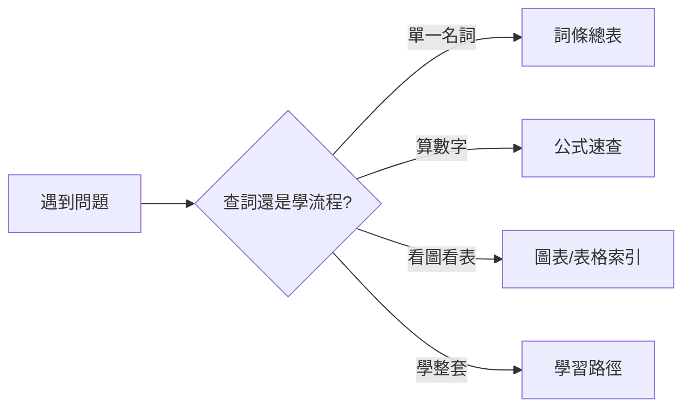

# 基本資料書使用指南

## 本篇你會學到

- 如何把 Stock School 當**字典**或**工具書**查閱
- 三種使用方式與對應入口
- 全站參考資料地圖

本站既是**系統教材**，也是**隨查隨用的台股基本資料書**。不必從頭讀到尾。

---

## 三種使用方式

| 方式 | 適合情境 | 從這裡進 |
|------|----------|----------|
| **字典查詞** | 「這個詞是什麼？」 | [完整詞條總表](../02-glossary/dictionary.md) |
| **速查表** | 「公式／縮寫／圖表哪一頁？」 | [公式速查](formulas.md)、[稅費總覽](taxes-for-costing.md)、[縮寫對照](abbreviations.md)、[圖表總覽](../04-charts/index.md) |
| **系統學習** | 從零建立完整觀念 | [入門導覽](../01-basics/index.md) → [對號入座](../10-persona/index.md) → [投資模式](../08-investing/index.md) |
| **對號查身分** | 「我是誰、該怎麼投？」 | [對號入座](../10-persona/index.md) |

---

## 字典模式：怎麼查最快

### 1. 站內搜尋（推薦）

左側搜尋框輸入關鍵字，例如：

- 中文 `軋空`、`停損`、`晨星`，或英文／縮寫 `PER`、`short squeeze`、`stop loss`
- 詞典已附英文欄，搜英文也能命中對應詞條
- 可搜到詞條、案例、表格說明

### 2. 完整詞條總表

[完整詞條總表](../02-glossary/dictionary.md) 收錄 **100+ 詞條**，每條含：

- **英文對照**
- **一句話定義**
- **分類**
- **延伸連結**（詳解章節）

### 3. 分類詞典（深入）

需要「定義 + 誤解 + 例子」時，進分類專頁：

| 分類 | 連結 |
|------|------|
| 行情 | [quotes.md](../02-glossary/quotes.md) |
| 交易行為 | [trading-terms.md](../02-glossary/trading-terms.md) |
| 損益 | [pnl.md](../02-glossary/pnl.md) |
| 持倉 | [position.md](../02-glossary/position.md) |
| 籌碼 | [chips.md](../02-glossary/chips.md) |
| 基本面 | [fundamentals.md](../02-glossary/fundamentals.md) |
| 技術面 | [technical.md](../02-glossary/technical.md) |
| 市場進階 | [market-terms.md](../02-glossary/market-terms.md) |
| 風控 | [risk.md](../02-glossary/risk.md) |

---

## 工具書模式：查表、查圖、查流程

### 表格（數字從哪來）

| 需求 | 章節 |
|------|------|
| 多檔比較 | [個股總覽](../03-tables/watchlist.md) |
| 營收 | [月營收表](../03-tables/revenue.md) |
| 法人 | [三大法人](../03-tables/institutional.md) |
| 融資券 | [融資融券](../03-tables/margin.md) |
| 估值 | [估值表](../03-tables/valuation.md) |
| 評分 | [評分量表](../03-tables/scoring.md) |
| 單檔全分頁 | [深入分析地圖](../03-tables/deep-dive-tabs.md) |

### 圖表（圖怎麼讀）

| 需求 | 章節 |
|------|------|
| 全部分類 | [圖表總覽](../04-charts/index.md) |
| K 線 | [K 線基礎](../04-charts/kline-basics.md) |
| 分時 | [分時圖](../04-charts/intraday-charts.md) |
| 量價 | [量價圖](../04-charts/volume-price.md) |
| 籌碼圖 | [籌碼圖表](../04-charts/chips-charts.md) |
| 基本面圖 | [基本面圖表](../04-charts/fundamental-charts.md) |
| 指標 | [指標速查](../04-charts/indicator-quickref.md) |

### 流程（怎麼做）

| 需求 | 章節 |
|------|------|
| 第一次下單 | [第一筆交易走一遍](../01-basics/first-trade-walkthrough.md) |
| 選模式 | [對號入座](../10-persona/index.md) · [投資模式](../08-investing/index.md) · [模式與心態](../08-investing/mode-psychology.md) |
| 研究步驟 | [研究流程](../09-advanced/research-workflow.md) |
| 風控 | [停損](../06-risk/stop-loss.md)、[資金](../06-risk/capital.md)、[突發狀況手冊](../06-risk/emergency-playbook.md) |
| 下單前檢查 | [投資檢查清單](investor-checklist.md) |
| 卡關提問 | [常見問答 FAQ](faq.md) |
| 案例 | [實戰案例](../07-cases/revenue-turn.md)（含 [0050 定額](../07-cases/etf-dca-drawdown.md)） |

---

## 附錄速查清單

| 附錄 | 用途 |
|------|------|
| [公式速查](formulas.md) | 漲跌幅、市值、PER、損益、部位 |
| [縮寫對照](abbreviations.md) | EPS、YoY、IOC、ADR… |
| [影片索引](video-resources.md) | 影片名詞對照本站 |
| [資料來源](data-sources.md) | 公開資料哪裡找 |
| [工具對照](stock-tool-map.md) | Stock Bot 對照（選用） |
| [程式詞對照](dev-glossary.md) | 學員詞 ↔ 程式欄位 |

---

## 建議書籤（常駐分頁）

| 書籤 | 原因 |
|------|------|
| [完整詞條總表](../02-glossary/dictionary.md) | 查詞首選 |
| [公式速查](formulas.md) | 算損益、估值 |
| [圖表總覽](../04-charts/index.md) | 確認圖表類型 |
| [對號入座](../10-persona/index.md) | 依身分找投資模式 |
| [投資模式地圖](../08-investing/index.md) | 知道下一步讀哪章 |
| [模式與心態](../08-investing/mode-psychology.md) | 對齊心理與盯盤頻率 |

---

## 與紙本工具書的差異

| 紙本 | 本站 |
|------|------|
| 固定版本 | 可搜尋、可連結跳轉 |
| 一種編排 | 同一詞：字典 → 分類詳解 → 模式 → 案例 |
| 圖表少 | 含 K 線 SVG、Mermaid 流程 |

---

## 重點回顧

- **查詞** → [完整詞條總表](../02-glossary/dictionary.md) + 搜尋框。
- **算數** → [公式速查](formulas.md)。
- **學整套** → [入門](../01-basics/index.md) / [老手](../09-advanced/index.md) 路徑。
- 免責：內容僅供教學，見 [免責聲明](disclaimer.md)。
